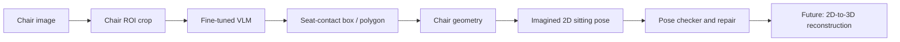

# ChairPose

단일 의자 이미지에서 **사람이 실제로 앉을 수 있는 좌판 영역(seat-contact)**을 찾고,
그 영역을 기준으로 가상의 2D 착석 자세를 추론하는 실험 프로젝트입니다.

현재 연구의 중심은 `SmolVLM + LoRA`를 이용해 의자 이미지에서 좌판 접촉 영역을
직접 예측하는 것입니다. 전체 착석 자세 생성 파이프라인과 Apple Silicon 기반
VLM 파인튜닝 도구를 함께 제공합니다.

> 현재 상태: 연구 진행 중입니다. 데이터셋 변환, LoRA 학습, 평가, 단일 이미지
> 추론 파이프라인은 동작하지만, VLM 좌판 검출은 아직 실사용 수준이 아닙니다.

## 문제 정의

입력:

- 사람이 없는 단일 의자 이미지

중간 출력:

- 사람이 엉덩이로 접촉할 수 있는 좌판 영역
- chair geometry: 좌판, 등받이, 바닥선

최종 목표:

- 가상의 착석 인체 2D keypoints
- 각 keypoint의 confidence와 visibility
- 자세 타당성 검사 결과
- 이후 2D-to-3D 역추적에 사용할 접촉/기하 정보

의자 전체 segmentation이 아니라 **실제 착석 가능한 표면**을 찾는 것이 핵심입니다.
등받이, 다리, 팔걸이, 배경은 seat-contact 영역에 포함하지 않습니다.

## 전체 파이프라인



현재 `v18` 실험에서는 COCO chair detector가 **의자 주변 crop만 생성**합니다.
최종 seat-contact 영역은 detector가 아니라 파인튜닝된 VLM이 예측합니다.

## 주요 기능

- LabelMe `seat_contact` polygon을 VLM SFT JSONL로 변환
- polygon, 4-point quadrilateral, bounding box 타깃 지원
- pixel 좌표와 discrete grid 좌표 지원
- chair crop 후 `224 x 224` 이미지 생성
- Apple Silicon MPS 기반 SmolVLM LoRA 학습
- 체크포인트별 JSON/schema 유효성 및 IoU 평가
- 단일 이미지 추론, 원본 좌표 복원, overlay 생성
- 비정상 polygon/box reject 규칙
- Gemini 또는 Ollama 기반 다단계 착석 자세 추론

## 현재 실험 결과

가장 최근 실험은 `SmolVLM-500M-Instruct`를 사용한 `v18`입니다.

설정:

- 입력: chair crop, `224 x 224`
- 출력: `16 x 16` grid상의 seat-contact bounding box
- 학습 샘플: 164장
- 검증 샘플: 18장
- 학습 방식: PEFT LoRA, completion-only loss
- 디바이스: Apple MPS

`checkpoint-45` 검증 결과:

| Metric | Result |
| --- | ---: |
| Valid JSON rate | 0.5556 |
| Schema-valid rate | 0.5000 |
| Mean IoU (all samples) | 0.0935 |
| Mean IoU (schema-valid only) | 0.1871 |
| Best sample IoU | 0.2930 |

이전 full-image pixel bbox 실험의 Mean IoU 약 `0.016`보다 개선됐지만,
별도 hardcase 의자에서는 JSON 생성이 무너져 IoU `0.0`을 기록했습니다.

현재 확인된 주요 실패 패턴:

- Python dict 형태의 작은따옴표 출력
- 중복 JSON key 생성
- `image_size`와 bbox 필드 혼합
- 전체 grid 또는 고정 좌표 출력
- 학습 분포 밖 의자에서 일반화 실패

세부 실험 기록은 [VLM 실험 보고서](docs/vlm_experiments_ko.md)를 참고하세요.

## 저장소 구조

```text
chairpose/
├── run_chair_sitting_pose.py          # 전체 2D 착석 자세 파이프라인
├── prompts/                           # 단계별 VLM system prompts
├── schemas/                           # 엄격한 JSON schema
├── scripts/
│   ├── build_vlm_dataset_from_labelme.py
│   ├── validate_vlm_jsonl.py
│   ├── train_vlm_lora_mps.py
│   ├── eval_vlm_polygon_quality.py
│   ├── infer_vlm_polygon.py
│   └── setup_mps_vlm_env.sh
├── docs/
│   ├── chair_sitting_pose_mvp.md
│   ├── mps_vlm_setup.md
│   ├── vlm_finetune_mps_guide.md
│   └── vlm_experiments_ko.md
└── requirements-mps-vlm.txt
```

`data/`, `runs/`, 모델 weight와 로컬 가상환경은 Git에 포함되지 않습니다.

## 환경

권장 환경:

- macOS + Apple Silicon
- Python 3.10 이상
- PyTorch MPS
- 메모리 16GB 이상

환경 생성:

```bash
git clone https://github.com/khk0606/chair_pose.git
cd chair_pose
bash scripts/setup_mps_vlm_env.sh
source .venv-mps-vlm/bin/activate
python scripts/check_mps_vlm_env.py
```

`READY: True`와 `mps available=True`가 출력되면 학습 환경이 준비된 것입니다.

## 데이터 형식

LabelMe 이미지와 JSON 파일을 동일한 stem으로 배치합니다.

```text
/path/to/chair_dataset/
├── chair_001.jpg
├── chair_001.json
├── chair_002.png
└── chair_002.json
```

JSON에는 다음과 같은 polygon이 필요합니다.

```json
{
  "shapes": [
    {
      "label": "seat_contact",
      "shape_type": "polygon",
      "points": [[120, 210], [320, 205], [345, 270], [105, 275]]
    }
  ]
}
```

원본 데이터와 학습 체크포인트는 이미지 저작권과 용량 문제로 저장소에 포함하지
않습니다.

## VLM 데이터셋 생성

현재 권장 설정은 chair crop + 16x16 grid bbox입니다.

```bash
source .venv-mps-vlm/bin/activate

python scripts/build_vlm_dataset_from_labelme.py \
  --src-dir /path/to/chair_dataset \
  --out-dir data/vlm_seatcontact_v18 \
  --label seat_contact \
  --target-shape bbox \
  --coord-mode grid \
  --grid-size 16 \
  --crop-mode chair \
  --chair-detector yolov8x-seg.pt \
  --chair-device mps \
  --crop-margin-ratio 0.10 \
  --target-width 224 \
  --target-height 224 \
  --write-resized-images \
  --train-ratio 0.90 \
  --val-ratio 0.10
```

Ultralytics가 `yolov8x-seg.pt`를 찾지 못하면 최초 실행 시 weight를 다운로드합니다.
이 detector는 chair crop 생성에만 사용됩니다.

생성 파일:

```text
data/vlm_seatcontact_v18/
├── images_resized/
├── train.jsonl
├── val.jsonl
├── test.jsonl
├── manifest.csv
└── build_report.json
```

검증:

```bash
python scripts/validate_vlm_jsonl.py \
  --jsonl data/vlm_seatcontact_v18/train.jsonl \
  --jsonl data/vlm_seatcontact_v18/val.jsonl \
  --target-shape bbox \
  --coord-mode grid
```

## LoRA 학습

```bash
python scripts/train_vlm_lora_mps.py \
  --model-name HuggingFaceTB/SmolVLM-500M-Instruct \
  --train-jsonl data/vlm_seatcontact_v18/train.jsonl \
  --val-jsonl data/vlm_seatcontact_v18/val.jsonl \
  --output-dir runs/vlm_v18/gate \
  --epochs 3 \
  --lr 2e-5 \
  --train-batch-size 1 \
  --eval-batch-size 1 \
  --grad-accum 8 \
  --logging-steps 5 \
  --eval-steps 5 \
  --save-steps 5 \
  --max-steps 45 \
  --gradient-checkpointing \
  --no-dataloader-pin-memory
```

## 평가

```bash
python scripts/eval_vlm_polygon_quality.py \
  --adapter-dir runs/vlm_v18/gate/checkpoint-45 \
  --jsonl data/vlm_seatcontact_v18/val.jsonl \
  --output-json runs/vlm_v18/eval_step45.json \
  --target-shape bbox \
  --coord-mode grid \
  --max-new-tokens 256 \
  --device mps
```

평가 결과에는 다음 지표가 저장됩니다.

- valid JSON rate
- schema-valid rate
- placeholder rate
- 전체 샘플 Mean IoU
- schema-valid 샘플 Mean/Median IoU
- 샘플별 원문 출력과 예측 좌표

## 단일 이미지 추론

```bash
python scripts/infer_vlm_polygon.py \
  --adapter-dir runs/vlm_v18/gate/checkpoint-45 \
  --image /path/to/chair.jpg \
  --output-json runs/infer/chair.json \
  --output-overlay runs/infer/chair_overlay.png \
  --target-shape bbox \
  --coord-mode grid \
  --grid-size 16 \
  --crop-mode chair \
  --chair-detector yolov8x-seg.pt \
  --chair-device mps \
  --resize-width 224 \
  --resize-height 224 \
  --device mps
```

출력 JSON에는 VLM 원문, 파싱 결과, crop 좌표, 원본 이미지 좌표, reject 사유가
함께 기록됩니다.

## 전체 착석 자세 추론

`run_chair_sitting_pose.py`는 다음 단계를 수행합니다.

1. 의자 part anchor 추출
2. 좌판, 등받이, 바닥선 geometry 추정
3. 가상의 착석 인체 keypoint 생성
4. VLM checker와 deterministic checker 실행
5. 필요하면 repair prompt로 재생성

Ollama 예시:

```bash
python run_chair_sitting_pose.py \
  --backend ollama \
  --model qwen2.5vl:3b \
  --image /path/to/chair.jpg \
  --output runs/chair_pose_result.json \
  --no-part-segmentation \
  --min-score 3 \
  --timeout 420
```

Gemini 예시:

```bash
export GEMINI_API_KEY="..."

python run_chair_sitting_pose.py \
  --backend gemini \
  --model gemini-2.5-pro \
  --image /path/to/chair.jpg \
  --output runs/chair_pose_result.json \
  --part-segmentation \
  --min-score 3
```

## 한계와 다음 과제

- 현재 데이터의 유니크 의자 수가 적어 형태 다양성이 부족합니다.
- VLM이 좌표보다 JSON 템플릿을 학습하는 collapse가 발생합니다.
- hardcase 검증셋이 작아 일반화 성능을 충분히 측정하지 못했습니다.
- chair crop 단계가 외부 detector에 의존합니다.
- 출력 constrained decoding과 더 짧은 target schema가 필요합니다.
- 새로운 의자 형태와 촬영 각도를 포함한 데이터 확장이 필요합니다.
- 2D seat-contact와 keypoint를 3D 좌표로 연결하는 단계는 아직 구현 중입니다.

다음 실험은 출력 형식을 `{"box":[x1,y1,x2,y2]}`처럼 단순화하고,
별도의 hardcase validation set으로 체크포인트를 선택하는 방향입니다.

## 문서

- [Chair Sitting Pose MVP](docs/chair_sitting_pose_mvp.md)
- [Apple MPS 환경 설정](docs/mps_vlm_setup.md)
- [VLM 파인튜닝 가이드](docs/vlm_finetune_mps_guide.md)
- [VLM 실험 보고서](docs/vlm_experiments_ko.md)
